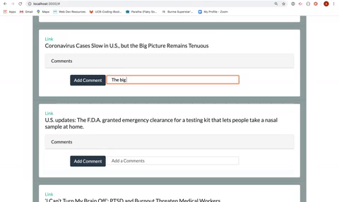

# News Scraper Project READ ME
        
## Summary

This web application allows users to view and leave comments on the latest news. The news are scrapped from the New York Times Website. When users request more news, the comment associated with headlines remain.

## Site Picture



## Table of Contents

- [Technologies Used](#Technologies-Used)
- [Learning Points](#Learning-Points)
- [Use](#Use)
- [Installation](#Installation)
- [Code Snippets](#Code-Snippets)
- [Usage](#Usage)
- [Author](#Author)

## Technologies Used
- mongo - used to store and retrieve data
- cheerio - used to parse scraped data
- Javascript / Node / Handlebars - used to build an interactive and dynamic app
- Bootstrap - used to create a clean looking website
- Git - version control system for tracking changes to code
- Github - to host the repository
- Heroku - to host the deployed site

## Learning Points
- How to set up a model with a one to many relationship nested and how to remove elements within that nested array.
- How to scrape data from other websites. It is as much art as it is a science.
- Reinforced bringing together APIs that make call to the applications' server versus an external source.

## Dependencies
```
express
express-handlebars
mongoose
cheerio
axios
```
## Installation
To interact with the website, access the heroku deployed site. To create your own New York Times scraper:

- You will need to download this folder into your computer either by cloning the git repository or downloading the files are a zip.
- Once the files are accessible in tour local computer, navigate inside the employee tracker folder and do an install of the following packages by using: 
```
npm install mongoose
npm install express-handlebars
npm install express
npm install cheerio
npm install axios

```

- Run the program by using the following command:
```
node server.js
```

- Exit the program and run the seed.js file under the seeder folder. This will not create any data but will boot the model tables.


## Usage
- To get new news articles, click the new articles button on the jumbotron.

## Code Snippet
Now that I've had the chance to work with React and Handlebars, I had a hardtime rewiring my brain to loop through data in order to render html. It became a good stopping point that I went back to after a good night sleep.

Aside from that hiccup, the most challenging and interesting piece of the code dealt with removing comments from the comments array within the Article comments.

```
 app.put("/api/articles/:id/remove", (req, res) => {
    console.log(res)
    db.Article.findOneAndUpdate(
      { _id: req.params.id },
      { $pull: {  comments: {_id: req.body._id} }}, 
      { safe: true, multi:true })
      .then(result => {
      console.log(result)
      res.json(result)
    }).catch(err => {
      res.json(err)
    });
  });
```


## Author
[GitHub](https://github.com/analoo)

